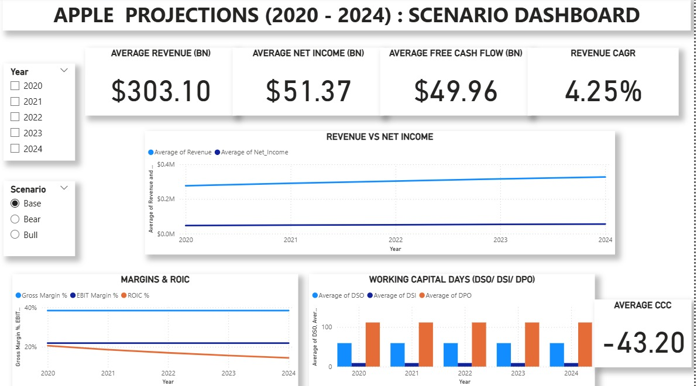

# Apple Financial Modeling — Excel + Power BI (+ Python prep)

Driver-based 3-statement model (Excel) and an interactive Power BI dashboard built from Kaggle historicals (2016–2019) with projections to 2024.

**TL;DR highlights**
- 3-statement model with assumptions & scenarios (growth, margins, capex, WC, tax)
- Power BI dashboard: Executive Summary, 3-Statement, Actuals vs Projections, KPI deep-dive
- Accounting checks: BS balances; CF ties to change in cash; YoY variance visuals

## 🔎 Quick Demo
> (Replace with your exports)

## 📂 Open the work
- **Excel model:** [`excel/Financial Modelling.xlsx`](excel/Financial%20Modelling.xlsx)  
- **Assumptions:** [`excel/Apple.cxlsx`](excel/Apple.cxlsx)  
- **Power BI file:** [`powerbi/APPLE PROJECTIONS.pbix`](powerbi/APPLE%20PROJECTIONS.pbix)  
- **Notebook (prep):** [`python/apple_model.ipynb`](python/apple_model.ipynb)  
- **Raw data:** [`data/raw/Raw Data.xlsx`](data/raw/Raw%20Data.xlsx)

## ▶️ How to run (quick)
**Excel:** Open `Financial Modelling.xlsx`, tweak drivers in `Apple.cxlsx`, review IS/BS/CF.  
**Power BI:** Open `APPLE PROJECTIONS.pbix` → set data source paths → **Refresh**.  
**Python (optional):** Run `apple_model.ipynb` to standardize inputs for BI.

> Display units: set major cards/axes to **Billions** in Power BI.

## 🧰 Tech
Excel • Power BI • Python (pandas)

*Educational project. Not investment advice.*
